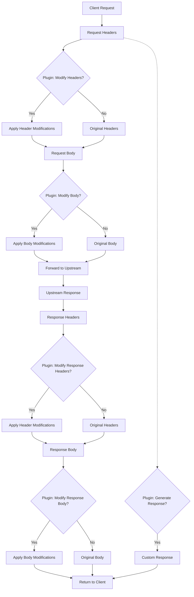
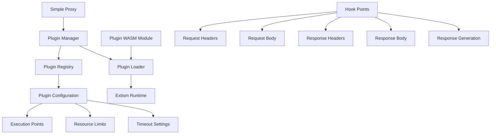

# Plugin System Implementation Plan

## Requirements Analysis

The requirement is to integrate Extism for a plugin-based system in Simple Proxy with these capabilities:
- Modify request headers
- Modify request headers and body
- Modify response headers
- Modify response headers and body
- Generate custom responses based on request information

## Components Affected

1. **Core Proxy Pipeline**
   - Request filtering stages
   - Response filtering stages
   - Request/response body handling

2. **Configuration System**
   - Plugin configuration and loading
   - Plugin execution settings

3. **Error Handling**
   - Plugin execution failures
   - Timeouts and resource limits

## Architecture Considerations

### Plugin Integration Points



### Plugin Architecture



## Implementation Strategy

1. **Add Extism integration**
   - Implement as a new crate dependency
   - Create a plugin management subsystem
   - Define common plugin interfaces

2. **Design the plugin interface**
   - Create standardized function definitions
   - Define data structures for requests/responses
   - Establish error handling patterns

3. **Modify proxy pipeline**
   - Add plugin execution points
   - Implement data conversion between proxy and plugin formats
   - Add bypass mechanisms for efficiency

4. **Create configuration system**
   - Define plugin configuration format
   - Implement plugin loading and initialization
   - Add runtime management capabilities

5. **Develop example plugins**
   - Create reference implementations
   - Document plugin development process
   - Build testing infrastructure

## Detailed Steps

### 1. Extism Integration (2-3 days)

1. **Add dependencies**
   - Add Extism Rust SDK to Cargo.toml
   - Add serialization support for plugin data

2. **Create plugin management module**
   ```
   src/plugins/
   ├── mod.rs        # Module exports
   ├── manager.rs    # Plugin manager implementation
   ├── registry.rs   # Plugin registry
   ├── interface.rs  # Common plugin interfaces
   └── errors.rs     # Plugin-specific errors
   ```

3. **Implement basic plugin loading**
   - Create `PluginManager` struct
   - Add plugin discovery and loading
   - Implement resource limits and timeouts

### 2. Plugin Interface Design (3-4 days)

1. **Define common data structures**
   - Request representation
   - Response representation
   - Configuration options

2. **Create standard plugin functions**
   ```rust
   // Plugin function signatures
   fn process_request_headers(headers: Map<String, String>) -> Result<Map<String, String>>;
   fn process_request_body(headers: Map<String, String>, body: Vec<u8>) -> Result<Vec<u8>>;
   fn process_response_headers(req_headers: Map<String, String>, resp_headers: Map<String, String>) -> Result<Map<String, String>>;
   fn process_response_body(headers: Map<String, String>, body: Vec<u8>) -> Result<Vec<u8>>;
   fn generate_response(req_headers: Map<String, String>, req_body: Vec<u8>) -> Result<Option<Response>>;
   ```

3. **Implement error handling patterns**
   - Define plugin error types
   - Create retry and timeout mechanisms
   - Add logging for plugin execution

### 3. Proxy Pipeline Integration (3-4 days)

1. **Modify `SimpleProxy` implementation**
   - Add plugin manager as a component
   - Create plugin context for request/response cycle

2. **Add plugin execution points**
   - Update `request_filter` for request headers
   - Update `request_body_filter` for request body
   - Update `upstream_response_filter` for response headers
   - Update `response_body_filter` for response body
   - Add early return option in `request_filter` for custom responses

3. **Implement data conversion**
   - Convert between HTTP types and plugin data structures
   - Handle binary and text payloads appropriately
   - Optimize for performance with minimal copying

### 4. Configuration System (2-3 days)

1. **Define plugin configuration format**
   ```yaml
   plugins:
     - name: example-plugin
       path: /path/to/plugin.wasm
       config:  # Plugin-specific configuration
         key: value
       enabled: true
       execution_points:
         - request_headers
         - response_body
       timeout_ms: 100
       memory_limit_mb: 10
   ```

2. **Update configuration parsing**
   - Add plugin section to configuration schema
   - Implement validation for plugin settings
   - Add plugin hot-reload capability

3. **Create plugin lifecycle management**
   - Initialize plugins at startup
   - Handle plugin failures gracefully
   - Support runtime reload of plugins

### 5. Example Plugins & Documentation (3-4 days)

1. **Create example plugins**
   - Header modification example
   - Body transformation example
   - Cache control plugin
   - Response generation plugin
   - Rate limiting plugin

2. **Document plugin development**
   - Create plugin development guide
   - Document API and data structures
   - Add examples for common use cases

3. **Add plugin testing infrastructure**
   - Create mock request/response objects
   - Implement test harness for plugins
   - Add plugin benchmarking tools

## Dependencies

- Extism SDK for Rust
- WebAssembly support in the build environment
- Serialization libraries for plugin data structures
- Test infrastructure for plugins

## Challenges & Mitigations

1. **Performance Impact**
   - **Challenge**: Plugin execution could add latency
   - **Mitigation**: Implement bypass mechanisms for paths not needing plugins, add caching for plugin results

2. **Memory Safety**
   - **Challenge**: Plugins could crash or leak memory
   - **Mitigation**: Use Extism's sandboxing, add resource limits and timeouts

3. **Plugin Development Complexity**
   - **Challenge**: Complex API might discourage plugin development
   - **Mitigation**: Create simple examples, provide SDK in multiple languages

4. **Error Handling**
   - **Challenge**: Plugin failures could impact proxy stability
   - **Mitigation**: Implement circuit breakers, fallback mechanisms, and graceful degradation

5. **Configuration Complexity**
   - **Challenge**: Plugin configuration adds complexity
   - **Mitigation**: Provide sensible defaults, validation, and clear documentation

## Creative Phase Components

This implementation requires creative design for the plugin interface and integration points. The key areas needing creative exploration are:

1. **Plugin Host Interface**: Designing an efficient and intuitive interface between Simple Proxy and Extism
2. **Data Conversion**: Finding the optimal way to convert between HTTP types and plugin data structures
3. **Error Handling**: Developing a comprehensive strategy for plugin failures
4. **Plugin Configuration**: Creating a flexible but simple configuration system
