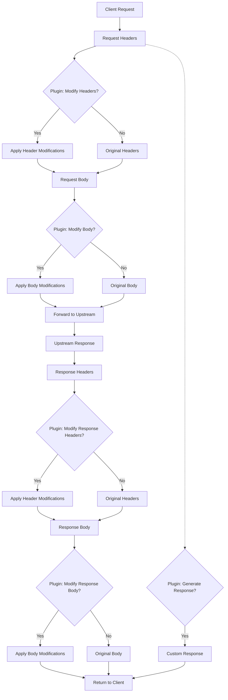
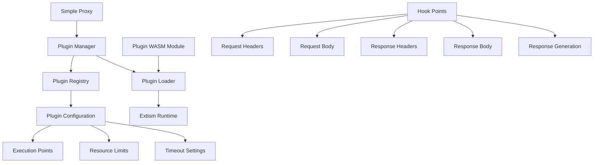

VAN: please initialize memory bank based on the @_code.md


Enter PLAN mode: the next biggest thing for this project is to use extism to support a plugin based system to make it pretty flexible to extend the tool. The core system should allow plugin to do the following things:
- modify request header
- modify request header and body
- modify response header
- modify response header and body
- based on the request info, directly generated response header and body for the core to response

plugin flow:



plugin architecture:




Enter IMPLEMENT mode, please first define proper data structure to integrate extism sdk


Based on @_code.md please help me update README.md. Make sure you have a section on how to develop / build / config a plugin. Then have a demo section to tell user how to run the whole setup by:

```
RUST_LOG=info cargo run --example server -- -p 3001 # run first  server
RUST_LOG=info cargo run --example server -- -p 3002 # run second server
RUST_LOG=info cargo run -- -c fixtures/app.yml # run proxy
```
